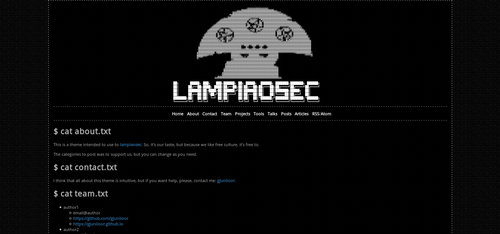

# Darcli

## Demo

You can see this theme on [gjuniioor.github.io/darcli](https://gjuniioor.github.io/darcli)

## Screenshot

## Why the name?

It's just a joke: `dark + cli`.

## Features

* Categories
* Disqus comments
* SEO
	* Description
	* Keywords
	* Open Cards to twitter, facebook, linkedin, google+ and others
* Code post (but no highligth :] )
* Atom **AND** RSS feeds

## Warnings

This is a theme intended to use to [lampiaosec website](https://lampiaosec.github.io) and after was converted to a general theme to jekyll.

So, any questions, can you contact me ([@gjuniioor](https://github.com/gjuniioor)) or open a [issue](https://github.com/gjuniioor/darcli/issuesi).

## License

This theme is under [GPL3](assets/LICENSE).
